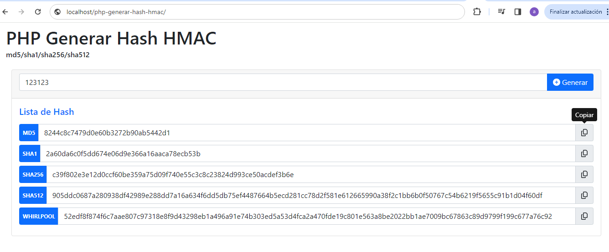
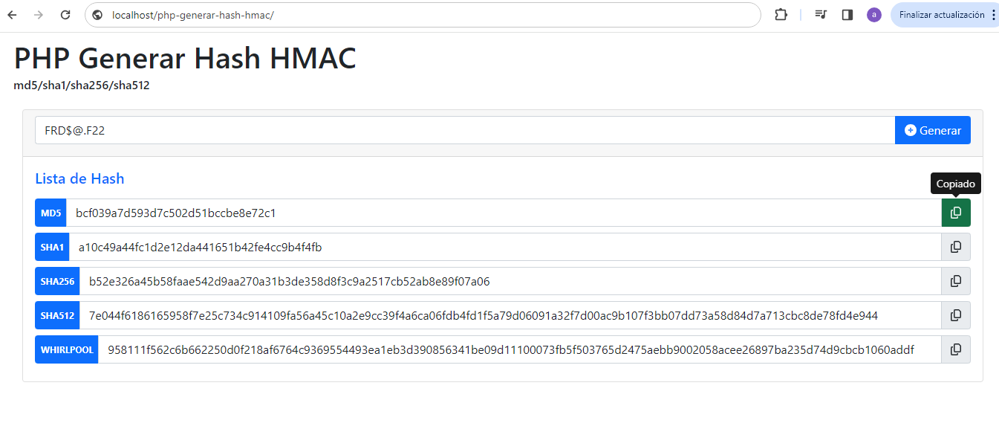

# php-generar-hash-hmac
PHP 7, PHP 8 donde ingresas un texto y genera los Hash HMAC md5/sha1/sha256/sha512 [https://www.php.net/manual/es/function.hash-hmac.php]
La Clave secreta se guarda en la constante `PRIVATE_KEY` en el archivo hash-hmac.php

[http://localhost/php-generar-hash-hmac]

Librerias
- [ ] jquery-3.7.1. [https://jquery.com/download/]
- [ ] Bootstrap 5.1 [https://getbootstrap.com/docs/5.1/getting-started/download/]
- [ ] sweetalert2 [https://sweetalert2.github.io/#download]
- [ ] Font Awesome Free 6.5.1 [https://fontawesome.com/download]


## Clonar Repositorio
```
git clone https://github.com/compuvalpo/php-generar-hash-hmac.git
```

## Comparar Hashed
Para comparar si 2 Hash son iguales, se debe utilizar la función hash_equals [https://www.php.net/manual/es/function.hash-equals.php]
```
if (hash_equals($hash_conocido, $hash_a_comparar) ) {
	echo "Son iguales";
}
```

## Capturas

